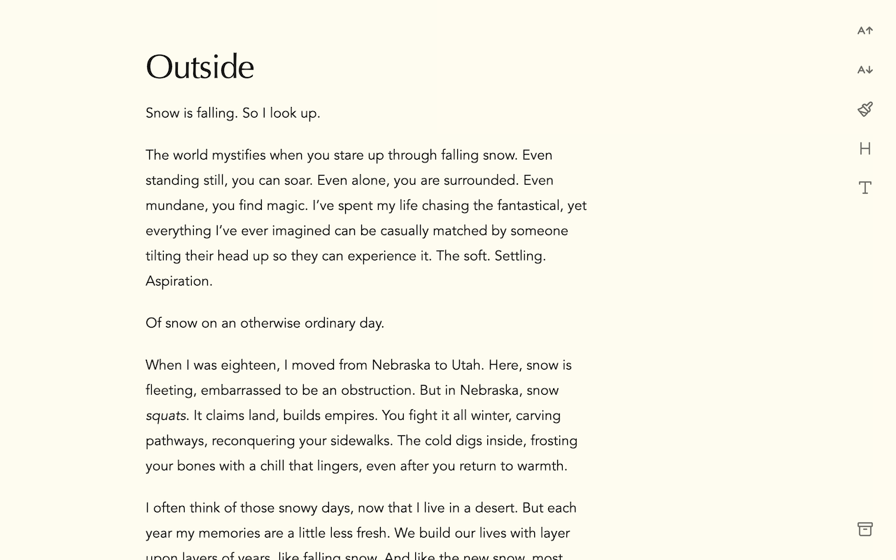
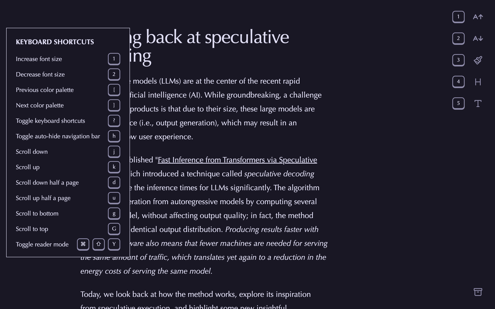
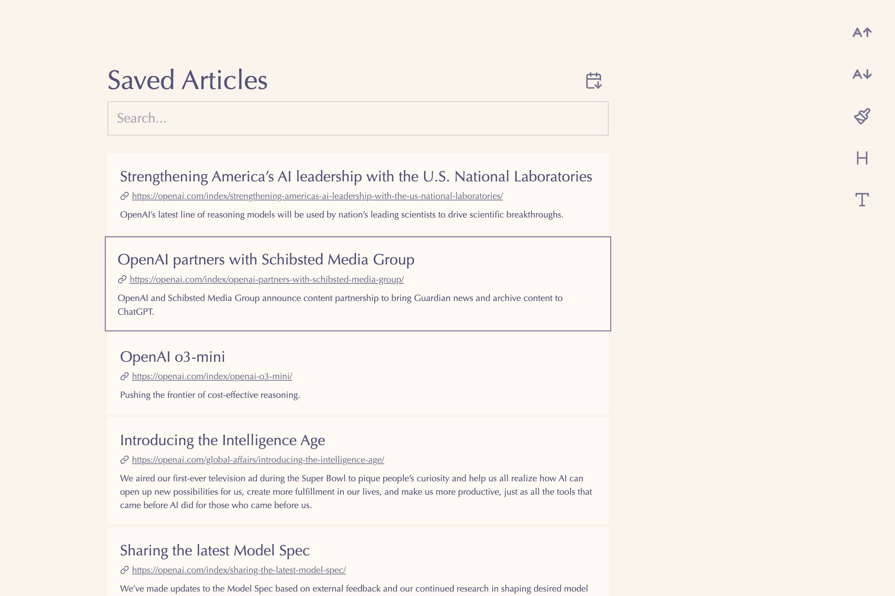

# Ream

Ream is a simple, clean, open-source reader mode extension for Chrome and Firefox.

[Firefox Link](https://addons.mozilla.org/en-US/firefox/addon/ream)

Chrome version is still in review!

## Screenshots

## Motivation

I find most existing reader mode extensions to be lacking in the things I need.
Many of them have outdated UIs, are closed-source, and in some [cases](https://arstechnica.com/security/2025/01/dozens-of-backdoored-chrome-extensions-discovered-on-2-6-million-devices/) contain [malware](https://readermode.io/blog/articles/reader-mode-security-incident-what-happened-and-our-response).

There are some great open-source reader mode extensions, but the user interfaces don't appeal to me.

In the spirit of [personal software](https://leerob.com/n/personal-software),
I spent a few days learning about creating browser extensions and built my own reader mode!

## Permissions

- `activeTab`: To access the current tab's content.
- `storage`: To save the user's theme preferences.
- `scripting`: To replace the current page's content with the reader mode version (under a Shadow Root).

## Libraries

- [wxt](https://wxt.dev/): Framework for building cross-browser extensions.
- [react](https://react.dev/): UI.
- [lucide-react](https://lucide.dev/): Icons.
- [tailwindcss](https://tailwindcss.com/): Styling.
- [Radix UI](https://www.radix-ui.com/) / [shadcn](https://ui.shadcn.com/): Functionality for dropdown menu and buttons. I did the styling on my own.
- [Flexoki](https://github.com/kepano/flexoki) and [Rose Pine](https://rosepinetheme.com/) themes.
- [Readability](https://github.com/mozilla/readability): For extracting the main content from the page.
- [usehooks](https://usehooks.com/): Screen size hook.
- [DexieJS](https://dexie.org/): Wrapper for accessing IndexedDB.
- [MiniSearch](https://github.com/lucaong/minisearch): Full text search of saved articles.
- [wouter](https://github.com/molefrog/wouter): Hash-based routing.

## License

This project is licensed under the MIT License. See the [LICENSE](LICENSE) file for details.
