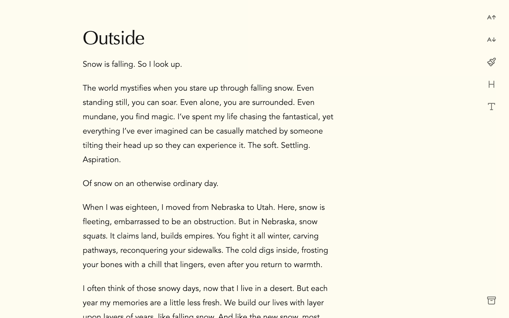
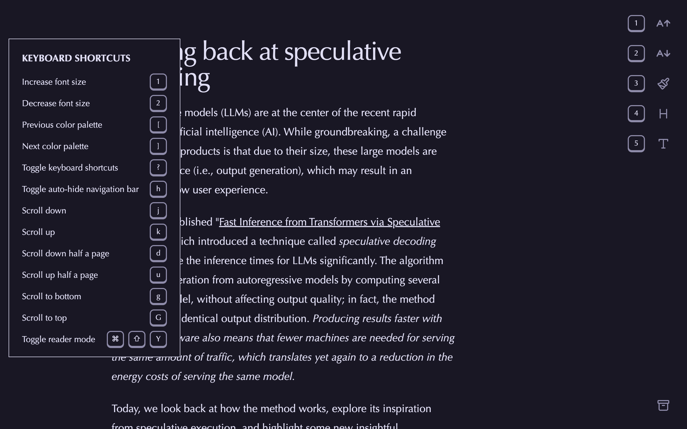

# Ream

Ream is a simple, clean, open-source reader mode extension for Chrome and Firefox.

## Screenshots

## Motivation

I find most reader mode extensions out there to be lacking.
Many of them have outdated UIs, are closed-source, and in some [cases](https://arstechnica.com/security/2025/01/dozens-of-backdoored-chrome-extensions-discovered-on-2-6-million-devices/) contain [malware](https://readermode.io/blog/articles/reader-mode-security-incident-what-happened-and-our-response).

The best reader view extension out there is by [rNeomy](https://github.com/rNeomy/reader-view?tab=readme-ov-file).
It's open-source, but the UI doesn't appeal to me.

As a result, I set out to spend a few days building my own reader mode and to learn about creating browser extensions.

## Permissions

- `activeTab`: To access the current tab's content.
- `storage`: To save the user's theme preferences.
- `scripting`: To replace the current page's content with the reader mode version (under a Shadow Root).

## Libraries

- [wxt](https://wxt.dev/): To build the extension.
- [react](https://react.dev/): UI.
- [lucide-react](https://lucide.dev/): Icons.
- [tailwindcss](https://tailwindcss.com/): Styling.
- [Flexoki](https://github.com/kepano/flexoki) and [Rose Pine](https://rosepinetheme.com/) themes.
- [Readability](https://github.com/mozilla/readability) for extracting the main content from the page.
